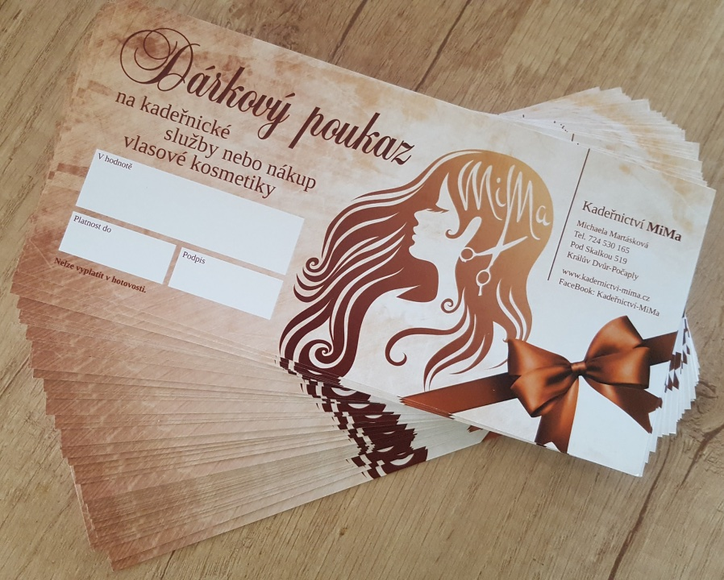

Pokud se Vám ceník níže špatně čte, podívejte se na jeho [tištěnou verzi](/pdf/20200401-mima-cenik.pdf).

|                                                     |                |                 |                 |
| --------------------------------------------------- |:--------------:|:---------------:|:---------------:|
| Dámský střih                                        |basic&nbsp;450  |                 |special&nbsp;550 |
|                                                     |**krátké&nbsp;**|**střední&nbsp;**|**dlouhé**       |
| Barva komplet                                       |      850       |       990       |      1150       |
| Zesvětlování plošné komplet                         |     1100       |      1250       |      1450       |
| Tónování po zesvětlení                              |      250       |       300       |       350       |
| Melír komplet                                       |     1125       |      1350       |      1700       |
| Melír sekce                                         |      250       |       300       |       350       |
| Melír + barva komplet                               |     1350       |      1575       |      1800       |
| Foukaná                                             |      220       |       260       |       320       |
| Žehlení, kulmování, vodová (střih +200)             |      450       |       530       |       600       |
| Trvalá komplet                                      |      900       |      1050       |      1250       |
| Permanentní narovnání vlasů                         |                | od&nbsp;1600    |                 |
| Ošetření ultrazvukovou infračervenou žehličkou      |      ---       |       250       |       400       |
| Společenský účes                                    |                | od&nbsp;700     |                 |
| Silk glaze (za každch 10 ml) a hloubková regenerace |                |                 |        40       |
| Malibu C (střih +200)                               |                |                 |       650       |
| Vymývací lázeň                                      |                |                 | od&nbsp;450     |
| Ofina                                               |                |                 |        50       |
| Střih strojkem, dětský střih                        |                |                 |       150       |
| Pánský střih                                        |                |                 |       180       |
| Úprava vousů ke střihu                              |                |                 |        50       |
| Pánský střih komplet                                |                |                 |       220       |
&nbsp;

* "Komplet" je služba, ve které je zahrnuto zároveň mytí, střih, foukaná a styling
* U služby komplet bez střihu se odečítá 200 Kč
* Za střih k dalším úkonům jako např. žehlení, trvalá, atd. se přičítá 200 Kč
* Nabízím také dárkové poukazy

